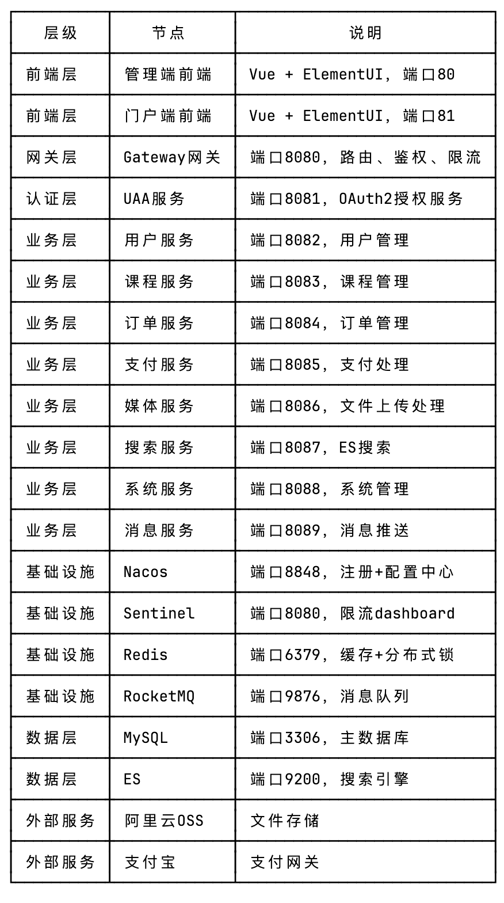
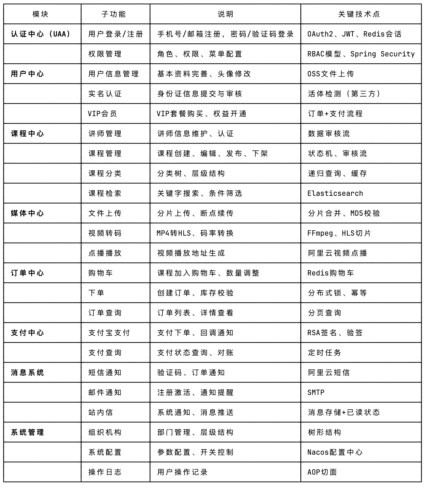
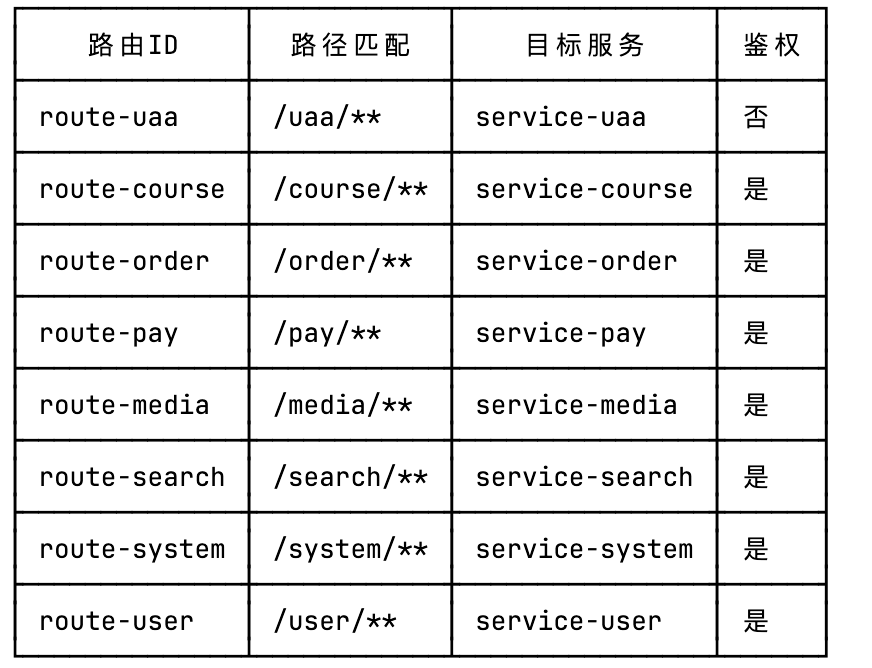

3.1 设计目标与原则                                                                                                                                                          
3.1.1 设计目标                                                                                                                                                              
本系统旨在构建一个功能完善、性能可靠的在线教育云平台，基于微服务架构实现课程管理、用户学习、订单支付、媒体处理等核心功能，具体设计目标如下：
（1）高可用性
系统需保证7×24小时稳定运行，各微服务采用集群部署方式，通过Nacos实现服务注册与发现，单一服务节点故障不影响整体系统可用性。关键业务服务（如订单、支付）部署多副本，结合Redis缓
存与消息队列实现数据冗余，确保系统故障时能够快速恢复。
（2）高并发处理能力
课程秒杀、限时优惠等场景下，系统需承受瞬时高并发请求。通过Sentinel实现流量控制与熔断降级，结合Redis缓存热点数据、MQ异步消峰，有效应对突发流量冲击，避免数据库连接耗尽导致的
系统雪崩。
（3）系统扩展性
采用微服务架构设计，各业务模块独立部署、独立扩展。课程服务、用户服务、订单服务等可根据业务负载单独扩容。基于Nacos的配置中心支持动态修改配置参数，无需重启服务即可实现功能迭
代与性能调优。
（4）安全性保障
用户敏感信息加密存储，支付接口采用RSA签名验签确保交易安全。统一鉴权采用JWT无状态令牌，结合OAuth2授权码模式实现细粒度权限控制。接口层面实现请求限流、防SQL注入、XSS过滤等安全
措施。
（5）数据一致性
订单支付场景采用可靠消息最终一致性方案，通过RocketMQ事务消息保障跨服务数据一致性。库存扣减、余额变动等关键操作采用分布式事务控制（Seata），确保强一致性场景下的数据准确。
3.1.2 设计原则
（1）前后端分离原则
前端采用Vue.js + ElementUI构建独立部署的单页应用，通过RESTful
API与后端通信。前端负责页面渲染与交互逻辑，后端专注于业务数据处理，实现关注点分离，便于团队并行开发与独立部署迭代。
（2）微服务拆分原则
按照业务边界将系统划分为独立的微服务，各服务拥有独立的数据库表空间，通过Feign声明式HTTP客户端进行服务间调用。服务间遵循高内聚、低耦合设计，避免循环依赖，确保单一服务变更不
影响其他服务正常运行。
（3）统一鉴权原则
所有业务接口均需通过网关层统一鉴权，无状态JWT令牌携带用户身份信息与权限标识在各服务间流转。OAuth2授权服务器（UAA）负责身份认证与令牌颁发，各业务服务仅验证令牌有效性，实现认
证与业务分离。
（4）接口幂等性原则
对于涉及数据变更的接口（如下单、支付回调），必须实现幂等性控制。通过唯一流水号、分布式锁、数据库唯一约束等机制防止重复请求导致的重复处理，确保在网络抖动、客户端重试等场景下
数据准确性。
（5）异步解耦原则
非实时性要求的操作（如消息推送、积分计算、日志记录）采用MQ异步处理。主流程仅关注核心业务逻辑，异步任务通过消息队列可靠投递，接收方消费失败时支持重试，确保最终一致性。
（6）接口规范化原则
所有对外接口采用统一的响应格式（JSONResult），包含状态码、消息、数据字段。HTTP方法遵循RESTful规范，GET用于查询、POST用于创建、PUT用于更新、DELETE用于删除。接口文档通过Swagg
er2自动生成，保证前后端对接效率。
3.2 系统总体架构设计
3.2.1 架构分层概述
本系统采用典型的六层架构设计，从上至下依次为：前端接入层、网关路由层、认证授权层、业务服务层、基础设施层、数据存储层。各层职责清晰，单向依赖，通过标准化接口进行跨层通信。
前端接入层由管理端与门户端两部分组成。管理端面向管理员与讲师，提供课程管理、订单审核、用户管理等功能；门户端面向普通用户，提供课程浏览、购买学习、个人中心等功能。前端通过Ng
inx反向代理部署，静态资源本地缓存，动态请求转发至网关层。
网关路由层基于Spring Cloud Gateway实现，负责请求路由、负载均衡、限流熔断、权限校验等横切关注点。所有外部请求经由网关统一入口，网关根据路由规则将请求分发至对应业务服务，同时
集成Sentinel实现流量控制，保护后端服务免受异常流量冲击。
认证授权层（UAA服务）负责用户身份认证与权限管理。基于Spring Security
OAuth2构建，支持密码模式、授权码模式等多种认证方式。认证成功后颁发JWT令牌，令牌包含用户ID、角色、权限等信息，有效期内各服务可自行解析验证，无需查询认证服务。
业务服务层包含用户服务、课程服务、订单服务、支付服务、媒体服务、搜索服务、系统服务、消息服务等微服务。各服务独立部署，通过Nacos实现服务注册与发现，服务间调用采用Feign声明式
HTTP客户端实现同步调用，异步场景使用RocketMQ消息队列。
基础设施层提供系统运行所需的公共组件，包括：Nacos作为服务注册中心与配置中心，Sentinel作为流量控制与熔断降级组件，Redis作为分布式缓存与分布式锁介质，RocketMQ作为消息队列与事
务消息载体，阿里云OSS作为文件存储与媒体存储。
数据存储层采用MySQL作为主数据库，按业务域划分不同的数据库实例，避免单库性能瓶颈。MyBatis
Plus作为ORM框架，提供便捷的CRUD操作与代码生成能力。Elasticsearch用于课程全文检索，提供高性能搜索能力。
3.2.2 总体架构图说明
系统总体架构可绘制为以下结构：
节点列表：
┌──────────┬─────────────┬────────────────────────────┐
│   层级   │    节点     │            说明            │
├──────────┼─────────────┼────────────────────────────┤
│ 前端层   │ 管理端前端  │ Vue + ElementUI，端口80    │
├──────────┼─────────────┼────────────────────────────┤
│ 前端层   │ 门户端前端  │ Vue + ElementUI，端口81    │
├──────────┼─────────────┼────────────────────────────┤
│ 网关层   │ Gateway网关 │ 端口8080，路由、鉴权、限流 │
├──────────┼─────────────┼────────────────────────────┤
│ 认证层   │ UAA服务     │ 端口8081，OAuth2授权服务   │
├──────────┼─────────────┼────────────────────────────┤
│ 业务层   │ 用户服务    │ 端口8082，用户管理         │
├──────────┼─────────────┼────────────────────────────┤
│ 业务层   │ 课程服务    │ 端口8083，课程管理         │
├──────────┼─────────────┼────────────────────────────┤
│ 业务层   │ 订单服务    │ 端口8084，订单管理         │
├──────────┼─────────────┼────────────────────────────┤
│ 业务层   │ 支付服务    │ 端口8085，支付处理         │
├──────────┼─────────────┼────────────────────────────┤
│ 业务层   │ 媒体服务    │ 端口8086，文件上传处理     │
├──────────┼─────────────┼────────────────────────────┤
│ 业务层   │ 搜索服务    │ 端口8087，ES搜索           │
├──────────┼─────────────┼────────────────────────────┤
│ 业务层   │ 系统服务    │ 端口8088，系统管理         │
├──────────┼─────────────┼────────────────────────────┤
│ 业务层   │ 消息服务    │ 端口8089，消息推送         │
├──────────┼─────────────┼────────────────────────────┤
│ 基础设施 │ Nacos       │ 端口8848，注册+配置中心    │
├──────────┼─────────────┼────────────────────────────┤
│ 基础设施 │ Sentinel    │ 端口8080，限流dashboard    │
├──────────┼─────────────┼────────────────────────────┤
│ 基础设施 │ Redis       │ 端口6379，缓存+分布式锁    │
├──────────┼─────────────┼────────────────────────────┤
│ 基础设施 │ RocketMQ    │ 端口9876，消息队列         │
├──────────┼─────────────┼────────────────────────────┤
│ 数据层   │ MySQL       │ 端口3306，主数据库         │
├──────────┼─────────────┼────────────────────────────┤
│ 数据层   │ ES          │ 端口9200，搜索引擎         │
├──────────┼─────────────┼────────────────────────────┤
│ 外部服务 │ 阿里云OSS   │ 文件存储                   │
├──────────┼─────────────┼────────────────────────────┤
│ 外部服务 │ 支付宝      │ 支付网关                   │
└──────────┴─────────────┴────────────────────────────┘
连接关系：
前端 → Nginx → Gateway（路由）
Gateway → UAA（认证校验）
Gateway → 业务服务（路由分发）
业务服务 ↔ Feign（服务间调用）
业务服务 → MQ（异步消息）
业务服务 → Redis（缓存/锁）
业务服务 → MySQL（数据持久化）
搜索服务 ↔ ES（索引/搜索）
媒体服务 ↔ OSS（文件上传/下载）
件3.3 功能模块总体设计
3.3.1 模块划分
系统按照“端-中心-服务”三个维度进行功能模块划分。端指管理端与门户端；中心指业务领域划分的功能中心；服务指微服务部署单元。
管理端面向平台运营人员与讲师，主要功能包括：系统管理（组织机构、角色权限、字典配置）、课程管理（课程发布、审核、下架）、订单管理（订单查询、退款处理）、用户管理（用户信息、
VIP管理、实名认证）、数据统计（访问日志、操作日志）。
门户端面向普通用户与游客，主要功能包括：用户中心（注册登录、资料完善、实名认证、VIP购买）、课程中心（课程浏览、详情查看、收藏、立即购买）、学习中心（我的课程、学习进度、视
频播放）、订单中心（购物车、订单列表、支付）、个人中心（账户余额、收货地址、消息通知）。
3.3.2 功能模块详表
┌─────────────────┬───────────────┬──────────────────────────────────┬───────────────────────────┐
│      模块       │    子功能     │               说明               │        关键技术点         │
├─────────────────┼───────────────┼──────────────────────────────────┼───────────────────────────┤
│ 认证中心（UAA） │ 用户登录/注册 │ 手机号/邮箱注册，密码/验证码登录 │ OAuth2、JWT、Redis会话    │
├─────────────────┼───────────────┼──────────────────────────────────┼───────────────────────────┤
│                 │ 权限管理      │ 角色、权限、菜单配置             │ RBAC模型、Spring Security │
├─────────────────┼───────────────┼──────────────────────────────────┼───────────────────────────┤
│ 用户中心        │ 用户信息管理  │ 基本资料完善、头像修改           │ OSS文件上传               │
├─────────────────┼───────────────┼──────────────────────────────────┼───────────────────────────┤
│                 │ 实名认证      │ 身份证信息提交与审核             │ 活体检测（第三方）        │
├─────────────────┼───────────────┼──────────────────────────────────┼───────────────────────────┤
│                 │ VIP会员       │ VIP套餐购买、权益开通            │ 订单+支付流程             │
├─────────────────┼───────────────┼──────────────────────────────────┼───────────────────────────┤
│ 课程中心        │ 讲师管理      │ 讲师信息维护、认证               │ 数据审核流                │
├─────────────────┼───────────────┼──────────────────────────────────┼───────────────────────────┤
│                 │ 课程管理      │ 课程创建、编辑、发布、下架       │ 状态机、审核流            │
├─────────────────┼───────────────┼──────────────────────────────────┼───────────────────────────┤
│                 │ 课程分类      │ 分类树、层级结构                 │ 递归查询、缓存            │
├─────────────────┼───────────────┼──────────────────────────────────┼───────────────────────────┤
│                 │ 课程检索      │ 关键字搜索、条件筛选             │ Elasticsearch             │
├─────────────────┼───────────────┼──────────────────────────────────┼───────────────────────────┤
│ 媒体中心        │ 文件上传      │ 分片上传、断点续传               │ 分片合并、MD5校验         │
├─────────────────┼───────────────┼──────────────────────────────────┼───────────────────────────┤
│                 │ 视频转码      │ MP4转HLS、码率转换               │ FFmpeg、HLS切片           │
├─────────────────┼───────────────┼──────────────────────────────────┼───────────────────────────┤
│                 │ 点播播放      │ 视频播放地址生成                 │ 阿里云视频点播            │
├─────────────────┼───────────────┼──────────────────────────────────┼───────────────────────────┤
│ 订单中心        │ 购物车        │ 课程加入购物车、数量调整         │ Redis购物车               │
├─────────────────┼───────────────┼──────────────────────────────────┼───────────────────────────┤
│                 │ 下单          │ 创建订单、库存校验               │ 分布式锁、幂等            │
├─────────────────┼───────────────┼──────────────────────────────────┼───────────────────────────┤
│                 │ 订单查询      │ 订单列表、详情查看               │ 分页查询                  │
├─────────────────┼───────────────┼──────────────────────────────────┼───────────────────────────┤
│ 支付中心        │ 支付宝支付    │ 支付下单、回调通知               │ RSA签名、验签             │
├─────────────────┼───────────────┼──────────────────────────────────┼───────────────────────────┤
│                 │ 支付查询      │ 支付状态查询、对账               │ 定时任务                  │
├─────────────────┼───────────────┼──────────────────────────────────┼───────────────────────────┤
│ 消息系统        │ 短信通知      │ 验证码、订单通知                 │ 阿里云短信                │
├─────────────────┼───────────────┼──────────────────────────────────┼───────────────────────────┤
│                 │ 邮件通知      │ 注册激活、通知提醒               │ SMTP                      │
├─────────────────┼───────────────┼──────────────────────────────────┼───────────────────────────┤
│                 │ 站内信        │ 系统通知、消息推送               │ 消息存储+已读状态         │
├─────────────────┼───────────────┼──────────────────────────────────┼───────────────────────────┤
│ 系统管理        │ 组织机构      │ 部门管理、层级结构               │ 树形结构                  │
├─────────────────┼───────────────┼──────────────────────────────────┼───────────────────────────┤
│                 │ 系统配置      │ 参数配置、开关控制               │ Nacos配置中心             │
├─────────────────┼───────────────┼──────────────────────────────────┼───────────────────────────┤
│                 │ 操作日志      │ 用户操作记录                     │ AOP切面                   │
└─────────────────┴───────────────┴──────────────────────────────────┴───────────────────────────┘
3.4 核心业务流程设计
3.4.1 用户注册登录与统一鉴权流程
流程描述：
用户首次访问系统时，若需访问受保护资源，将被重定向至UAA服务登录页面。用户可以选择手机号+密码登录或手机号+验证码登录。验证码登录场景下，用户输入手机号后请求获取验证码，UAA服
务验证手机号格式后调用消息服务发送短信验证码，验证码存入Redis并设置5分钟有效期。
用户提交登录凭证后，UAA服务调用用户服务验证账号密码（或验证码）有效性。验证通过后，UAA服务生成JWT访问令牌（Access Token）与刷新令牌（Refresh
Token），令牌中包含用户ID、用户名、角色列表、权限列表等信息。令牌返回客户端后，前端将令牌存储于本地，后续请求通过请求头Authorization: Bearer {token}携带令牌。
当用户访问业务接口时，请求首先到达Gateway网关。网关提取请求头中的令牌，调用UAA服务的check_token接口验证令牌有效性（包括签名校验、过期时间校验）。验证通过后，网关解析令牌获
取用户信息，将用户ID、角色信息注入请求头，路由至对应业务服务。业务服务根据用户角色判断是否具有访问权限，若无权限则返回403 Forbidden。
异常处理：
令牌过期：前端收到401状态码后，使用刷新令牌请求UAA服务换取新令牌，成功后重发原请求
令牌无效/伪造：网关返回401，前端跳转至登录页面
验证码错误：限制同一手机号每分钟最多发送3次，单日最多发送10次，防止暴力破解
3.4.2 课程浏览与购买下单流程
流程描述：
用户登录门户端后，可通过课程列表页或搜索功能浏览课程。搜索请求发送至搜索服务，搜索服务查询Elasticsearch索引返回课程基本信息（ID、名称、封面、价格、讲师）。用户点击课程进入
详情页，详情页请求课程服务获取完整课程信息（章节列表、课程介绍、适用人群等），同时更新课程浏览日志。
用户确定购买后，可选择立即购买或加入购物车。立即购买场景下，前端请求订单服务创建订单。订单服务首先调用课程服务校验课程状态（已发布、未下架）与价格，获取最新价格防止前端篡改
。随后订单服务检查用户是否已购买该课程，若已购买则返回提示。
订单创建成功后，订单服务调用RocketMQ发送“订单创建成功”消息，消息服务消费消息后向用户发送站内信通知。订单状态为“待支付”，支付有效期为30分钟，超时后订单自动取消，库存释放。
用户选择支付宝支付后，前端调用支付服务发起支付请求。支付服务调用支付宝开放平台API创建支付订单获取支付宝交易号后返回给前端，前端拉起支付宝支付页面。                                                                                                                      
异常处理：                                                                                                                                                                  
课程下架：创建订单时校验课程状态，若已下架则提示"课程已下架"
库存不足：秒杀场景下需预先锁定库存，使用Redis分布式锁扣减库存，锁失败则提示"抢购火爆"
重复下单：订单创建接口实现幂等，校验同一用户+同一课程的待支付订单是否已存在
3.4.3 支付回调与订单状态流转
流程描述：
用户完成支付后，支付宝服务器异步通知支付服务支付结果（支付回调）。支付回调接口地址需在支付宝开放平台配置，且必须通过RSA2签名验签确保请求真实性。支付服务接收回调后，首先验证
签名，验签失败则忽略该请求。
验签通过后，支付服务根据商户订单号查询本地支付订单记录，若订单已处理（状态为已支付）则直接返回success，避免重复处理。接着更新支付订单状态为"已支付"，记录支付宝交易号、支付
时间等信息。
随后，支付服务调用RocketMQ发送"支付成功"消息。订单服务消费消息后，更新业务订单状态为"已支付"，并调用课程服务添加用户课程学习权限。课程服务处理成功后，用户即可在"我的课程"中
看到已购买的课程。
对于支付失败场景，支付宝同样会发送异步通知，支付服务更新支付订单状态为"支付失败"，订单服务更新业务订单状态为"支付失败"，用户可在订单列表中查看并重新发起支付。
异常处理：
签名验签失败：记录日志，告警通知，排查是否存在伪造请求
消息发送失败：支付服务本地记录待发送消息，定时任务补偿投递
订单服务处理失败：RocketMQ消费失败后自动重试，重试次数超过阈值进入死信队列，人工介入处理
幂等性：支付订单表商户订单号字段唯一索引，确保同一笔支付不会重复更新状态
3.4.4 视频分片上传与转码流程
流程描述：
用户（讲师）在管理端上传课程视频时，采用分片上传策略提升大文件上传成功率与用户体验。前端将视频文件切分为固定大小（如5MB）的分片，按顺序依次上传。每个分片携带文件唯一标识（f
ileId）、分片序号（chunkIndex）、总片数（totalChunks）参数。
媒体服务接收分片后，将分片临时存储至本地磁盘或OSS临时目录。当最后一个分片上传完成后，媒体服务触发分片合并逻辑，将所有分片按序号拼接为完整文件，并计算文件MD5值用于完整性校验
。
文件合并完成后，媒体服务调用视频转码工具进行格式转换。首先将原视频转换为标准MP4格式（统一编码），然后调用FFmpeg将MP4转换为HLS（.m3u8 +
.ts切片）格式，支持多码率转码（如360P、720P、1080P）以适应不同网络环境。转码完成后，将HLS文件上传至OSS存储。
转码过程中，媒体服务发送消息通知课程服务视频处理进度。课程服务更新课程媒体状态为"转码中"，转码成功后更新为"转码完成"，用户即可在门户端播放视频。播放时，前端请求媒体服务获取
播放地址，媒体服务返回OSS授权播放地址或HLS播放地址。
异常处理：
分片丢失：前端记录已上传分片列表，失败后从缺失分片继续上传
MD5校验失败：提示用户文件损坏，需重新上传
转码失败：重试3次仍失败则标记转码异常，发送告警通知运维人员
OSS上传失败：本地保留文件，定时任务重试上传
3.5 数据库总体设计
3.5.1 核心实体与关系
系统核心实体包括：用户（User）、角色（Role）、权限（Permission）、课程（Course）、课程章节（CourseChapter）、课程详情（CourseDetail）、讲师（Teacher）、订单（Order）、支付
订单（PayOrder）、支付流水（PayFlow）、媒体文件（MediaFile）、消息通知（Message）等。
主要实体关系：
用户与角色：多对多关系，通过user_role中间表关联
角色与权限：多对多关系，通过role_permission中间表关联
课程与章节：1对多关系，一个课程包含多个章节
课程与讲师：多对多关系，通过course_teacher中间表关联
用户与订单：1对多关系，一个用户可下多个订单
订单与订单项：1对多关系，一个订单可包含多个课程项
订单与支付订单：1对1关系，订单支付后生成支付订单
课程与媒体文件：1对多关系，课程包含多个视频/附
3.5.2 数据表分组
┌────────┬──────────────────────────────────────────────────────────────────────────────────────────────┬────────────────────────────────────────────────────────────────┐
│ 数据域 │                                            主要表                                            │                              说明                              │
├────────┼──────────────────────────────────────────────────────────────────────────────────────────────┼────────────────────────────────────────────────────────────────┤
│ 用户域 │ t_user, t_user_account, t_user_address, t_user_real_info, t_user_grow_log                    │ 用户基本信息、账户余额、收货地址、实名信息、成长值             │
├────────┼──────────────────────────────────────────────────────────────────────────────────────────────┼────────────────────────────────────────────────────────────────┤
│ 认证域 │ t_login_log, oauth_client_details, oauth_code, oauth_token                                   │ 登录日志、OAuth客户端信息、授权码、令牌                        │
├────────┼──────────────────────────────────────────────────────────────────────────────────────────────┼────────────────────────────────────────────────────────────────┤
│ 权限域 │ t_role, t_permission, t_menu, t_user_role, t_role_permission                                 │ 角色、权限、菜单、用户-角色、角色-权限                         │
├────────┼──────────────────────────────────────────────────────────────────────────────────────────────┼────────────────────────────────────────────────────────────────┤
│ 课程域 │ t_course, t_course_chapter, t_course_detail, t_course_market, t_course_type, t_teacher,      │ 课程基本信息、章节、详情、营销信息、分类、讲师、收藏、学习记录 │
│        │ t_course_teacher, t_course_collect, t_course_user_learn                                      │                                                                │
├────────┼──────────────────────────────────────────────────────────────────────────────────────────────┼────────────────────────────────────────────────────────────────┤
│ 订单域 │ t_course_order, t_course_order_item                                                          │ 订单主表、订单明细                                             │
├────────┼──────────────────────────────────────────────────────────────────────────────────────────────┼────────────────────────────────────────────────────────────────┤
│ 支付域 │ t_pay_order, t_pay_flow, t_alipay_info                                                       │ 支付订单、支付流水、支付宝配置                                 │
├────────┼──────────────────────────────────────────────────────────────────────────────────────────────┼────────────────────────────────────────────────────────────────┤
│ 媒体域 │ t_media_file                                                                                 │ 媒体文件信息（OSS路径、转码状态）                              │
├────────┼──────────────────────────────────────────────────────────────────────────────────────────────┼────────────────────────────────────────────────────────────────┤
│ 消息域 │ t_message_email, t_message_sms, t_message_station                                            │ 邮件、短信、站内信记录                                         │
├────────┼──────────────────────────────────────────────────────────────────────────────────────────────┼────────────────────────────────────────────────────────────────┤
│ 系统域 │ t_department, t_employee, t_system_dictionary, t_operation_log                               │ 部门、员工、字典、操作日志                                     │
└────────┴──────────────────────────────────────────────────────────────────────────────────────────────┴────────────────────────────────────────────────────────────────┘
3.5.3 E-R图文字描述
用户域ER图：
t_user（用户表）主键user_id，关联t_user_account（账户表）主键user_id，1对1
t_user关联t_user_address（地址表），1对多，user_id外键
t_user关联t_user_real_info（实名表），1对1，user_id外键
t_user通过user_role表关联t_role（角色表），多对多
课程域ER图：
t_course（课程表）主键course_id，关联t_course_chapter（章节表），1对多，course_id外键
t_course关联t_course_market（营销表），1对1，course_id外键
t_course关联t_course_detail（详情表），1对1，course_id外键
t_course通过course_teacher表关联t_teacher（讲师表），多对多
t_course关联t_course_type（分类表），course_type_id外键
订单支付ER图：
t_course_order（订单表）主键order_id，关联t_course_order_item（订单项表），1对多，order_id外键
t_course_order关联t_pay_order（支付订单表），1对1，order_id外键
t_pay_order关联t_pay_flow（支付流水表），1对多，pay_order_id外键
3.6 接口与通信总体设计
3.6.1 网关路由与鉴权
外部请求统一经由Gateway网关入口，网关配置路由规则将请求分发至对应服务。路由规则示例：
┌──────────────┬────────────┬────────────────┬──────┐
│    路由ID    │  路径匹配  │    目标服务    │ 鉴权 │
├──────────────┼────────────┼────────────────┼──────┤
│ route-uaa    │ /uaa/**    │ service-uaa    │ 否   │
├──────────────┼────────────┼────────────────┼──────┤
│ route-course │ /course/** │ service-course │ 是   │
├──────────────┼────────────┼────────────────┼──────┤
│ route-order  │ /order/**  │ service-order  │ 是   │
├──────────────┼────────────┼────────────────┼──────┤
│ route-pay    │ /pay/**    │ service-pay    │ 是   │
├──────────────┼────────────┼────────────────┼──────┤
│ route-media  │ /media/**  │ service-media  │ 是   │
├──────────────┼────────────┼────────────────┼──────┤
│ route-search │ /search/** │ service-search │ 是   │
├──────────────┼────────────┼────────────────┼──────┤
│ route-system │ /system/** │ service-system │ 是   │
├──────────────┼────────────┼────────────────┼──────┤
│ route-user   │ /user/**   │ service-user   │ 是   │
└──────────────┴────────────┴────────────────┴──────┘
网关集成JWT解析过滤器，请求进入网关时提取Authorization头中的令牌，调用UAA服务验证令牌有效性。验证通过后将用户ID、角色信息存入请求头（X-User-Id、X-User-Roles），下游服务通过
请求头获取用户身份。
3.6.2 统一响应格式
所有业务接口返回统一的JSON格式：
{
"code": 200,
"message": "操作成功",
"data": { ... }
}
状态码规范：2xx表示成功，4xx表示客户端错误（如400参数错误、401未认证、403无权限、404资源不存在），5xx表示服务端错误（如500内部异常）。业务错误码定义在ErrorCode枚举类中，各
服务共享统一错误码定义。
3.6.3 服务间通信
同步通信（Feign）： 适用于实时性要求高的场景，如订单创建时查询课程价格、用户信息校验等。服务A调用服务B时，Feign基于HTTP协议进行RPC调用，默认超时时间30秒。Feign整合Hystrix实
现熔断降级，当服务B不可用时，服务A快速失败返回降级响应，避免线程阻塞。
异步通信（MQ）： 适用于非实时性要求或需要解耦的场景，如订单创建成功后发送站内信、支付成功后更新课程权限、文件上传成功后触发转码等。生产者将消息发送至RocketMQ，消费者订阅主
题进行异步处理。消息消费失败时支持重试，重试次数超过阈值进入死信队列，需人工介入处理。
3.6.4 接口幂等设计
对于涉及数据变更的接口，通过以下方式实现幂等：
唯一流水号：支付回调接口根据商户订单号（唯一）作为幂等键，同一订单号重复回调不重复处理
分布式锁：下单接口基于用户ID+课程ID加分布式锁，防止并发重复下单
数据库唯一约束：订单表商户订单号字段唯一索引，重复插入会报错
3.6.5 熔断限流
Sentinel集成至Gateway与各业务服务，实现限流与熔断。限流策略按QPS设置，秒杀接口限流1000QPS，普通接口限流500QPS。熔断策略按失败率设置，当接口失败率超过50%且请求数大于10时，熔
断10秒，期间直接返回降级响应。Sentinel Dashboard提供实时监控与规则配置界面。
3.7 部署与运行环境总体设计
3.7.1 部署拓扑
系统采用多节点集群部署，各组件部署规划如下：
┌──────────┬───────────────┬──────┬──────────────────────────────────────────┐
│   节点   │     组件      │ 数量 │                   说明                   │
├──────────┼───────────────┼──────┼──────────────────────────────────────────┤
│ 前端节点 │ Nginx         │ 2    │ 部署管理端与门户端前端，负载均衡         │
├──────────┼───────────────┼──────┼──────────────────────────────────────────┤
│ 网关节点 │ Gateway       │ 2    │ 集群部署，限流、路由                     │
├──────────┼───────────────┼──────┼──────────────────────────────────────────┤
│ 认证节点 │ UAA           │ 2    │ 集群部署，OAuth2授权                     │
├──────────┼───────────────┼──────┼──────────────────────────────────────────┤
│ 业务节点 │ 业务服务      │ 各2  │ 按服务重要性配置，课程/订单/支付重点保障 │
├──────────┼───────────────┼──────┼──────────────────────────────────────────┤
│ 注册配置 │ Nacos         │ 3    │ 集群部署，保证高可用                     │
├──────────┼───────────────┼──────┼──────────────────────────────────────────┤
│ 缓存节点 │ Redis         │ 3    │ Sentinel哨兵模式，主从自动切换           │
├──────────┼───────────────┼──────┼──────────────────────────────────────────┤
│ 消息队列 │ RocketMQ      │ 3    │ NameServer集群 + Broker集群              │
├──────────┼───────────────┼──────┼──────────────────────────────────────────┤
│ 数据库   │ MySQL         │ 2    │ 主从复制，读写分离                       │
├──────────┼───────────────┼──────┼──────────────────────────────────────────┤
│ 搜索节点 │ Elasticsearch │ 3    │ 集群部署，存储课程索引                   │
├──────────┼───────────────┼──────┼──────────────────────────────────────────┤
│ 存储节点 │ OSS           │ -    │ 阿里云对象存储，跨区域冗余               │
└──────────┴───────────────┴──────┴──────────────────────────────────────────┘
3.7.2 环境差异
┌──────┬────────────────────┬──────────┬───────────────┬────────────────┐
│ 环境 │      配置中心      │ 日志级别 │    数据库     │    外部依赖    │
├──────┼────────────────────┼──────────┼───────────────┼────────────────┤
│ 开发 │ Nacos dev命名空间  │ DEBUG    │ 本地MySQL     │ 阿里云测试环境 │
├──────┼────────────────────┼──────────┼───────────────┼────────────────┤
│ 测试 │ Nacos test命名空间 │ INFO     │ 测试MySQL集群 │ 阿里云测试环境 │
├──────┼────────────────────┼──────────┼───────────────┼────────────────┤
│ 生产 │ Nacos prod命名空间 │ WARN     │ 生产MySQL集群 │ 阿里云生产环境 │
└──────┴────────────────────┴──────────┴───────────────┴────────────────┘
开发环境配置本地Nacos、MySQL，外部服务调用阿里云测试环境。测试环境模拟生产架构，使用测试数据。生产环境使用高可用集群配置，日志仅记录ERROR及以上级别。
3.8 安全性与非功能总体设计
3.8.1 安全设计
身份认证与授权：
系统采用RBAC（基于角色的访问控制）模型，用户关联角色，角色关联权限。管理员在系统管理模块配置角色与权限，用户登录后根据角色获取对应菜单与操作权限。前端根据权限控制页面按钮显
示与隐藏，后端接口校验用户是否具有操作权限。
敏感操作（如删除订单、退款）需二次验证（短信验证码）。支付接口调用前需验证用户支付密码。
数据安全：
用户密码采用BCrypt加密存储，即使数据库泄露也无法还原明文。身份证号、银行卡号等敏感字段采用AES加密存储，密钥由配置中心统一管理。数据传输采用HTTPS加密，防止网络层窃听。
接口安全：
网关层实现请求限流，单IP每分钟最多100次请求。敏感接口（如支付）加入防重放机制，请求携带时间戳与随机数，服务端校验时间戳5分钟内有效。输入参数进行SQL注入、XSS过滤校验。
支付安全：
支付宝回调接口必须通过RSA2签名验签，确保请求来自支付宝服务器。支付金额以分为单位整型存储，避免浮点数精度问题。支付结果以服务端查询为准，不完全依赖回调通知。
3.8.2 性能设计                                                                                                                                                              
缓存策略：                                                                                                                              
系统采用多级缓存架构提升查询性能。第一级为本地缓存（Caffeine），存储热点数据如系统配置、字典项、课程分类等，缓存有效期30分钟。第二级为分布式缓存（Redis），存储用户会话、分
布式锁、热点业务数据如课程列表、用户权限等。
课程详情页数据访问频率高，采用缓存优先策略：查询时先从Redis获取，缓存未命中则查询MySQL并写入Redis。课程价格、库存等频繁变动的数据设置较短缓存时间（5分钟）或采用延迟删除策略
。缓存更新采用Cache-Aside模式，写操作时删除缓存，下次访问时加载最新数据。
分页与查询优化：
列表查询接口强制分页，默认每页20条记录，最大支持100条。分页参数传入页码与每页条数，SQL使用LIMIT OFFSET分页，避免全表扫描。排序字段需建立索引，确保排序效率。
关联查询场景使用MyBatis Plus的关联查询功能，避免N+1查询问题。对于复杂统计报表，采用定时任务预计算并存储结果，查询直接读取预计算结果。
连接池管理：
数据库连接池采用HikariCP，核心连接数10，最大连接数20，空闲超时5分钟。Redis连接池采用JedisPool，最大连接数50。HTTP连接池（Feign、RestTemplate）配置最大连接数200，单路由最大
连接数50。连接池合理配置避免连接耗尽或资源浪费。
异步处理：
非实时性要求的操作采用异步处理。日志记录采用异步日志框架，不阻塞主请求流程。消息推送、积分计算、成长值更新等操作发送MQ消息，异步消费处理。前端轮询或WebSocket推送获取异步任
务结果。
3.8.3 可靠性设计
超时重试：
服务间调用配置合理超时时间与重试策略。Feign默认超时时间30秒，重试次数3次（不含首次）。重试策略仅对网络异常、超时等临时故障生效，对业务异常（如参数错误）不重试。
消息消费采用至少一次投递策略，消费失败后重新投递。消息表记录消息状态，已消费消息不再重复处理。定时任务扫描超时未消费消息，进行补偿投递。
消息补偿：
支付成功消息、消费失败等关键消息采用可靠消息方案。消息发送方本地记录消息表，消息发送后更新状态为"已发送"。若MQ确认发送失败，定时任务补偿发送。消费方处理消息前先检查是否已处
理，避免重复消费。

